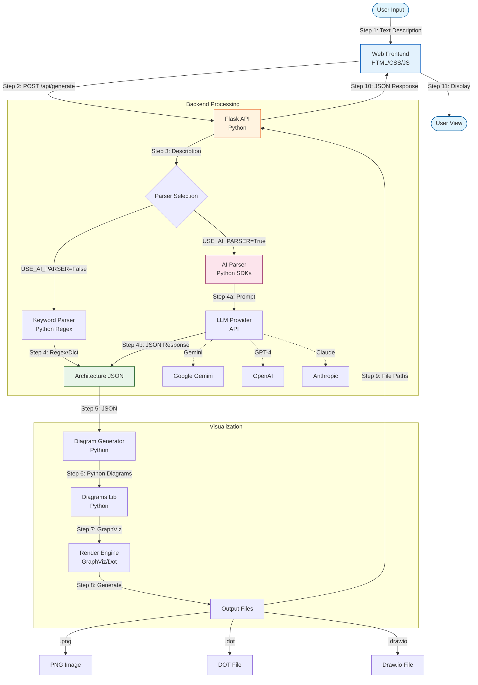

# Workflow & Architecture Maps Guide

## 🔄 Repository Workflow



---

## 🏗️ Connection Logic

### Efficient Traffic Flows
The system uses a **representative connection** strategy to keep diagrams clean and readable, especially for large architectures.

**Logic Applied**:
- Creates **ONE connection** per connection type between components.
- Labels indicate multiplicity when applicable (e.g., "× 2").
- Reduces visual clutter while maintaining logical clarity.

**Example**:
- **Scenario**: 2 App Services connecting to 1 SQL Database.
- **Result**: 1 connection line labeled "Connects to (×2)".

### Technical Implementation

**Code Pattern**:
```python
if source_components and target_components:
    source = source_components[0]  # Representative
    target = target_components[0]  # Representative
    label = base_label
    if len(source_components) > 1:
        label += f" (×{len(source_components)})"
    create_connection(source, target, label)
```

**Benefits**:
1. **Visual Clarity**: Readable, professional diagrams.
2. **Scalability**: Works for small (5) to large (50+) component counts.
3. **Semantic Preservation**: Multiplicity explicitly shown.

### Connection Label Examples
**Format**: `<base_label> (×<count>)`

**Examples**:
- "Routes web traffic" → Single instance
- "Routes web traffic (×2)" → 2 instances
- "Queries application data (×3)" → 3 instances

### Layer Organization
- `integrations`: For GitHub, MCP servers, external tools
- `external`: For third-party services
- `security`: Key Vault and security services

---

## 🎓 Icon Availability Matrix

| Service | Icon Type | Source | Status |
|---------|-----------|--------|--------|
| **GitHub** | Official GitHub logo | `diagrams.onprem.vcs` |  Available |
| **MCP Server** | Generic server | `diagrams.onprem.compute` |  Available |
| **Confluence** | Generic rack | `diagrams.generic.compute` | ⚠️ Placeholder |
| **Generic Server** | Server icon | `diagrams.onprem.compute` |  Available |

---

##  Example Use Cases

### Use Case 1: CI/CD Pipeline with GitHub

**Prompt**: "CI/CD pipeline with GitHub, Azure, and deployment to AKS"

**Generated Architecture**:
```
Components:
├── GitHub (source control)
├── Azure Container Registry
├── AKS (Kubernetes cluster)
├── Key Vault
└── Application Insights

Connections:
GitHub → Container Registry: "Push images"
Container Registry → AKS: "Pull and deploy (×3)"
AKS → Key Vault: "Retrieve secrets"
```

### Use Case 2: MCP-Enabled AI Platform

**Prompt**: "AI platform with MCP servers for context, Azure OpenAI, and documentation"

**Generated Architecture**:
```
Components:
├── MCP Server (context provider)
├── Azure OpenAI (Cognitive Services)
├── Confluence (documentation)
├── App Service
├── Cosmos DB
└── Redis Cache

Connections:
App Service → MCP Server: "Query context"
MCP Server → Cosmos DB: "Retrieve data (×2)"
App Service → Azure OpenAI: "AI requests"
```

### Use Case 3: Documentation & Collaboration Platform

**Prompt**: "Documentation platform with Confluence, Azure, and GitHub integration"

**Generated Architecture**:
```
Components:
├── GitHub (source docs)
├── Confluence (wiki)
├── App Service (converter)
├── Blob Storage (assets)
├── Azure Search
└── Application Insights

Connections:
GitHub → App Service: "Sync markdown"
App Service → Confluence: "Publish"
App Service → Blob Storage: "Store media (×2)"
```

---

##  How to Use

### Example 1: Simple Architecture (Verify Simplified Connections)
```bash
curl -X POST http://localhost:5001/api/generate \
  -H "Content-Type: application/json" \
  -d '{
    "description": "Web app with 3 app services connecting to SQL and Redis"
  }'
```

**Expected Output**:
- **Flow**: 1 → SQL "(×3)" + 1 → Redis "(×3)" = 2 connections

### Example 2: CI/CD with GitHub
```bash
curl -X POST http://localhost:5001/api/generate \
  -H "Content-Type: application/json" \
  -d '{
    "description": "CI/CD pipeline with GitHub, Azure Container Registry, and AKS"
  }'
```

**Expected Components**:
-  GitHub icon (official)
- Azure Container Registry
- AKS
- Application Insights

### Example 3: MCP-Enabled System
```bash
curl -X POST http://localhost:5001/api/generate \
  -H "Content-Type: application/json" \
  -d '{
    "description": "AI platform with MCP servers providing context to Azure OpenAI"
  }'
```

**Expected Components**:
-  MCP Server icon (server)
- Azure OpenAI (Cognitive Services)
- App Service
- Cosmos DB

---

##  Verification

### Test 1: Connection Simplification
```bash
# Generate complex architecture
curl -X POST http://localhost:5001/api/generate \
  -H "Content-Type: application/json" \
  -d '{"description": "E-commerce platform"}' \
  | jq '.architecture.connections | length'

# Should return ~10-15 instead of 30-40
```

### Test 2: GitHub Icon
```bash
# Generate with GitHub
curl -X POST http://localhost:5001/api/generate \
  -H "Content-Type: application/json" \
  -d '{"description": "CI/CD with GitHub"}' \
  | jq '.architecture.components[] | select(.type=="github")'

# Should return GitHub component with proper icon
```

### Test 3: MCP Server Icon
```bash
# Generate with MCP
curl -X POST http://localhost:5001/api/generate \
  -H "Content-Type: application/json" \
  -d '{"description": "System with MCP server"}' \
  | jq '.architecture.components[] | select(.type=="mcpserver")'

# Should return MCP Server component
```
